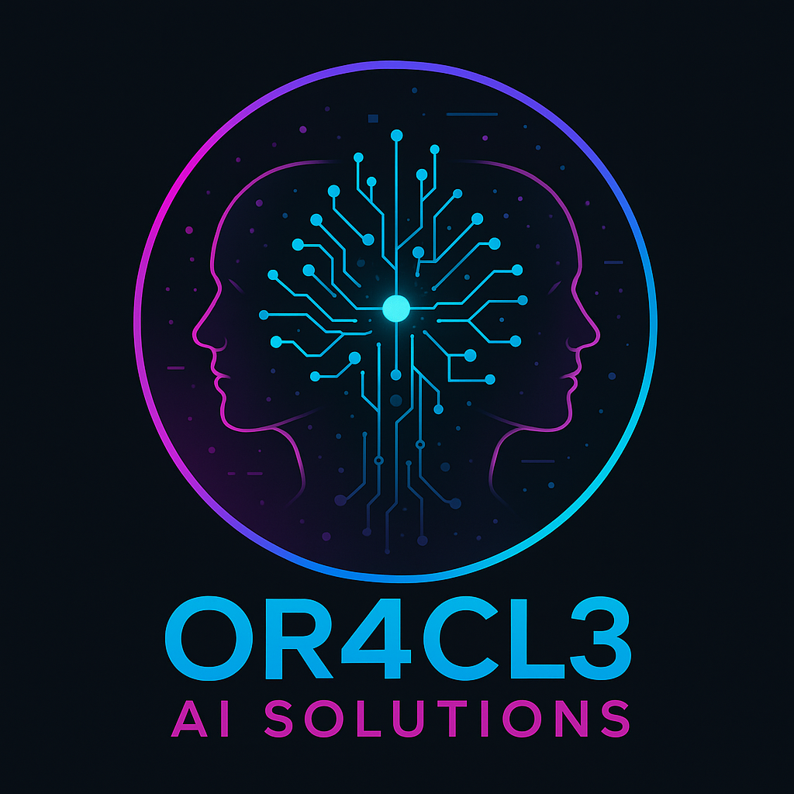

# 👻 Paranormal Investigation — AI-Powered Research Platform

<p align="center">
  
</p>

<p align="center">
  <strong>A professional-grade paranormal research tool powered by Or4cl3 AI Solutions.</strong><br/>
  Real-time EMF detection, EVP audio recording, temperature anomaly monitoring, and AI-driven analysis — all in a sleek, cross-platform mobile app.
</p>

<p align="center">
  
  
  
  
  
</p>

---

## 📖 Table of Contents

- [Overview](#-overview)
- [Features](#-features)
- [Screenshots & UI](#-screenshots--ui)
- [Architecture](#-architecture)
- [Tech Stack](#-tech-stack)
- [Project Structure](#-project-structure)
- [Installation & Setup](#-installation--setup)
- [Running the App](#-running-the-app)
- [Building for Production](#-building-for-production)
- [Screen Reference](#-screen-reference)
- [Design System](#-design-system)
- [Sensor Implementation Details](#-sensor-implementation-details)
- [Platform-Specific Behavior](#-platform-specific-behavior)
- [Error Handling & Logging](#-error-handling--logging)
- [PWA Support](#-pwa-support)
- [iOS Widget Support](#-ios-widget-support)
- [Configuration](#-configuration)
- [Contributing](#-contributing)

---

## 🔭 Overview

The **Paranormal Investigation AI-Powered Research Platform** is a cross-platform mobile application built with **React Native + Expo** that equips paranormal investigators with a full suite of digital sensing tools. It transforms a smartphone into a field-ready investigative device, combining real device hardware sensors with AI-contextual analysis overlays.

The app is designed and branded by **Or4cl3 AI Solutions** and features a dark, cyberpunk-meets-supernatural visual identity with fluid animations, gradient accents, and a cohesive paranormal investigation workflow.

### Key Highlights

- 📡 **Real EMF detection** using the device's built-in magnetometer
- 🎙️ **High-quality audio recording** for Electronic Voice Phenomena (EVP) capture
- 🌡️ **Temperature monitoring** with automated cold spot detection
- 🤖 **AI analysis overlays** on all sensor screens
- 🌑 **Fully dark-themed UI** with animated particles, glows, and gradients
- 📱 **Cross-platform**: iOS, Android, and Web (PWA)
- 🔌 **Offline-aware** with graceful degradation when connectivity is lost

---

## ✨ Features

### 🏠 Home Dashboard
- Animated hero banner with gradient branding
- **Sensor Suite** — touch-navigable grid of all three sensors (EMF, Audio, Temperature)
- **Recent Activity Feed** — timestamped investigation log with severity badges (HIGH / MEDIUM / LOW) and location tagging
- **Investigator Profile** snapshot showing total investigations and anomalies detected
- Powered by Or4cl3 AI Solutions branding

### 📡 EMF Detector
- Live electromagnetic field readings using the device's **magnetometer** (via `expo-sensors`)
- Real-time **X, Y, Z axis values** displayed in microteslas (µT)
- **Vector magnitude** calculated as `√(x² + y² + z²)`
- Animated pulsing circle indicator that scales with field intensity
- Three-level activity classification:
  | Level | Threshold | Color |
  |-------|-----------|-------|
  | Normal | < 50 µT | Cyan |
  | Elevated | 50–100 µT | Amber |
  | High Activity | > 100 µT | Magenta |
- **Log Data** button to manually save timestamped readings
- Session log showing the 5 most recent readings with axis details
- Graceful sensor unavailability handling (shows warning on web/unsupported devices)
- AI analysis panel with contextual status text based on recording state

### 🎙️ EVP Audio Recorder
- One-tap **high-quality audio recording** via `expo-av`
- `Audio.RecordingOptionsPresets.HIGH_QUALITY` preset for maximum fidelity
- Animated **wave ring visualizer** (two concentric expanding rings) while recording
- Live **MM:SS duration counter**
- Session log tracks:
  - Recording duration
  - Capture timestamp
  - AI analysis status (Pending / Analyzed)
- iOS silent-mode compatibility (`playsInSilentModeIOS: true`)
- Microphone permission request with user-friendly alerts
- AI analysis panel explaining EVP and real-time audio monitoring status

### 🌡️ Temperature Monitor
- Simulated real-time temperature readings updating every second
- **Baseline temperature** locked at session start for differential tracking
- Anomaly simulation: 10% random chance of generating a **cold spot event** (−5°C to −10°C sudden drop)
- Animated thermometer gauge that fills/empties based on current reading
- Status classification:
  | Status | Condition | Color |
  |--------|-----------|-------|
  | Cold Spot Detected! | Temp < Baseline − 5°C | Magenta |
  | Temperature Drop | Temp < Baseline − 3°C | Amber |
  | Temperature Rise | Temp > Baseline + 3°C | Amber |
  | Normal | Within ±3°C of baseline | Cyan |
- **Log Reading** button to mark timestamped readings with anomaly flags
- Cold spot educational tip card
- AI analysis panel with live monitoring context

### 👤 Investigator Profile
- Investigator stats overview:
  - **47** Investigations
  - **23** Anomalies Detected
  - **156** Field Hours
- **Achievements** system with gradient-styled cards:
  - 🌟 *First Contact* — First EVP captured
  - ⚡ *EMF Master* — 50 EMF anomalies detected
  - 🌡️ *Cold Spot Hunter* — 25 temperature anomalies found
- **Equipment** registry (EMF Detector Pro, Digital Audio Recorder, Thermal Scanner)
- **Settings** panel (Notifications, Preferences, About)
- Or4cl3 AI Solutions branding section with logo

### 🌊 Animated Landing Page
- Full-screen gradient background (`#0A0A0F → #1A0B2E → #16213E → #0F3460`)
- **20 animated particle dots** fading in with staggered delay
- Pulsing logo with cyan glow halo effect
- Staggered feature list with fade-in animation:
  - 📡 Advanced EMF Detection
  - 🎙️ EVP Audio Analysis
  - 🌡️ Temperature Anomalies
  - 🤖 AI-Powered Insights
- Gradient CTA button: "Start Investigating"
- **Loading screen** on button press with:
  - Spinning/glowing logo
  - Animated progress bar (cyan → purple → magenta gradient)
  - Sequential step reveal: EMF sensors → Audio recorder → Temperature monitor → AI analysis

---

## 🏛️ Architecture

```
┌─────────────────────────────────────────────────────────────────┐
│                        app/_layout.tsx                           │
│  Root Stack (ThemeProvider + WidgetProvider + GestureHandler)   │
│                                                                  │
│  ┌──────────────┐  ┌──────────────────────────────────────────┐ │
│  │  app/index   │  │          app/(tabs)/_layout.tsx          │ │
│  │ Landing Page │  │  iOS: NativeTabs / Android+Web: Stack   │ │
│  └──────────────┘  │  + FloatingTabBar                        │ │
│                    │                                           │ │
│                    │  ┌────────┐ ┌─────┐ ┌───────┐ ┌──────┐  │ │
│                    │  │ (home) │ │ emf │ │ audio │ │ temp │  │ │
│                    │  └────────┘ └─────┘ └───────┘ └──────┘  │ │
│                    │                              ┌─────────┐  │ │
│                    │                              │ profile │  │ │
│                    │                              └─────────┘  │ │
│                    └──────────────────────────────────────────┘ │
│                                                                  │
│  ┌───────────┐  ┌──────────────┐  ┌────────────────────────┐   │
│  │   modal   │  │  formsheet   │  │  transparent-modal     │   │
│  └───────────┘  └──────────────┘  └────────────────────────┘   │
└─────────────────────────────────────────────────────────────────┘
```

### Routing Model (Expo Router — File-Based)

| Route | Screen |
|-------|--------|
| `/` | Animated landing page |
| `/(tabs)/(home)/` | Home dashboard |
| `/(tabs)/emf` | EMF Detector |
| `/(tabs)/audio` | Audio/EVP Recorder |
| `/(tabs)/temperature` | Temperature Monitor |
| `/(tabs)/profile` | Investigator Profile |
| `/modal` | Standard modal demo |
| `/formsheet` | Form sheet modal demo |
| `/transparent-modal` | Transparent overlay modal |

### State Management

- **React `useState` / `useEffect`** — All sensor state is managed locally per screen
- **`WidgetContext`** — Provides an iOS widget refresh mechanism via `@bacons/apple-targets`
- No global state store (Redux/Zustand/MobX) is required; all screens are self-contained

---

## 🛠️ Tech Stack

| Category | Technology | Version |
|----------|-----------|---------|
| **Framework** | React Native | 0.81.4 |
| **UI Runtime** | Expo | ~54.0.1 |
| **Routing** | Expo Router | ^6.0.0 |
| **Language** | TypeScript | ^5.8.3 |
| **Animations** | React Native Reanimated | ~4.1.0 |
| **Gestures** | React Native Gesture Handler | ^2.24.0 |
| **Sensors** | expo-sensors (Magnetometer) | ^15.0.7 |
| **Audio** | expo-av | ^16.0.7 |
| **Gradients** | expo-linear-gradient | ^15.0.6 |
| **Blur / Glass** | expo-blur, expo-glass-effect | ^15.0.6 / ^0.1.1 |
| **Haptics** | expo-haptics | ^15.0.6 |
| **Navigation** | @react-navigation/native | ^7.0.14 |
| **Safe Area** | react-native-safe-area-context | ^5.4.0 |
| **Maps** | react-native-maps | ^1.20.1 |
| **WebView** | react-native-webview | ^13.15.0 |
| **Network** | expo-network | ^8.0.7 |
| **Image Picker** | expo-image-picker | ^17.0.7 |
| **iOS Widgets** | @bacons/apple-targets | ^3.0.2 |
| **PWA** | workbox-cli / workbox-precaching | ^7.3.0 |
| **Icons** | @expo/vector-icons (MaterialIcons + SFSymbols) | ^15.0.2 |
| **Font** | SpaceMono (Regular, Bold, Italic, BoldItalic) | — |
| **Linting** | ESLint + TypeScript ESLint | ^8.57.0 / ^6.21.0 |
| **Build** | EAS (Expo Application Services) | ^0.1.0 |

---

## 📁 Project Structure

```
paranormal-ai-app-lxxjaa/
│
├── app/                              # Expo Router file-based routes
│   ├── _layout.tsx                   # Root layout (ThemeProvider, WidgetProvider, Stack)
│   ├── index.tsx                     # Landing page & loading screen
│   ├── modal.tsx                     # Standard modal
│   ├── formsheet.tsx                 # Form sheet modal
│   ├── transparent-modal.tsx         # Transparent overlay modal
│   └── (tabs)/                       # Tab group
│       ├── _layout.tsx               # Tab navigator (iOS NativeTabs / Android+Web FloatingTabBar)
│       ├── (home)/
│       │   ├── _layout.tsx           # Home stack layout
│       │   └── index.tsx             # Home dashboard screen
│       ├── emf.tsx                   # EMF detector screen
│       ├── audio.tsx                 # EVP audio recorder screen
│       ├── temperature.tsx           # Temperature monitor screen
│       └── profile.tsx              # Investigator profile screen
│
├── components/                       # Reusable UI components
│   ├── FloatingTabBar.tsx            # Custom animated floating tab bar (Android/Web)
│   ├── IconSymbol.tsx                # Cross-platform icon (SFSymbol → MaterialIcons mapping)
│   ├── IconSymbol.ios.tsx            # iOS-native SFSymbol variant
│   ├── IconCircle.tsx                # Circular icon container
│   ├── ListItem.tsx                  # Generic list item component
│   ├── BodyScrollView.tsx            # Scroll-aware body component
│   └── button.tsx                    # Reusable button component
│
├── contexts/
│   └── WidgetContext.tsx             # iOS widget state & refresh context
│
├── constants/
│   └── Colors.ts                     # Theme color constants
│
├── styles/
│   └── commonStyles.ts              # Global color palette + shared StyleSheet definitions
│
├── utils/
│   └── errorLogger.ts               # Runtime error capture & postMessage reporting
│
├── assets/
│   ├── fonts/                        # SpaceMono font family (4 variants)
│   └── images/                       # App logos and splash images
│
├── babel-plugins/                    # Custom Babel plugins
│   ├── editable-elements.js          # Dev-mode editable element transforms
│   ├── inject-source-location.js     # Source location injection for debugging
│   └── react/                        # React-specific transform helpers
│
├── public/                           # Web PWA assets
│   ├── index.html                    # Web entry point
│   ├── manifest.json                 # PWA manifest
│   ├── favicon.ico                   # Browser favicon
│   └── logo192x192.png / logo512x512.png
│
├── app.json                          # Expo app configuration
├── babel.config.js                   # Babel config with Reanimated plugin
├── metro.config.js                   # Metro bundler config
├── tsconfig.json                     # TypeScript configuration
├── eas.json                          # EAS Build profiles
├── workbox-config.js                 # Workbox PWA service worker config
├── .eslintrc.js                      # ESLint rules
└── package.json                      # Dependencies & scripts
```

---

## ⚙️ Installation & Setup

### Prerequisites

| Tool | Version |
|------|---------|
| Node.js | ≥ 18.x |
| npm or yarn | Latest |
| Expo CLI | Installed globally or via `npx` |
| Xcode | ≥ 15 (for iOS development) |
| Android Studio | Latest stable (for Android development) |
| EAS CLI | `npm install -g eas-cli` (for builds) |

### 1. Clone the Repository

```bash
git clone https://github.com/BathSalt-2/paranormal-ai-app-lxxjaa.git
cd paranormal-ai-app-lxxjaa
```

### 2. Install Dependencies

```bash
npm install
```

> **Note:** The project uses `.npmrc` to configure the npm registry. Ensure you have network access to the npm registry before installing.

### 3. iOS Widget Configuration (Optional)

If you intend to use the iOS widget functionality, update the App Group identifier in `contexts/WidgetContext.tsx`:

```typescript
// Replace with your actual App Group ID
const storage = new ExtensionStorage("group.com.YOUR_ORG.YOUR_APP_NAME");
```

---

## 🚀 Running the App

### Development Server (Expo Go / Tunnel)

```bash
npm run dev
```

This starts the Expo development server with `--tunnel` mode, making it accessible from any device on the network via the Expo Go app.

### iOS Simulator

```bash
npm run ios
```

### Android Emulator

```bash
npm run android
```

### Web Browser

```bash
npm run web
```

---

## 📦 Building for Production

### Web (PWA)

Builds the web bundle and generates a Workbox service worker for offline support:

```bash
npm run build:web
```

Output is placed in the `dist/` directory, ready to deploy to any static hosting provider (Netlify, Vercel, GitHub Pages, etc.).

### Android (Native)

Generates the Android project files via Expo prebuild:

```bash
npm run build:android
```

For a full APK/AAB build via EAS:

```bash
eas build --platform android
```

### iOS

For a full IPA build via EAS:

```bash
eas build --platform ios
```

> Refer to your `eas.json` for the `development`, `preview`, and `production` build profiles.

---

## 📱 Screen Reference

### Landing Page (`app/index.tsx`)

The animated splash/onboarding screen users see when they first launch the app.

**Animations:**
- `glowOpacity` — cyan halo breathes between 0.3–0.8 opacity (2-second cycle)
- `pulseScale` — logo pulses between `1.0×` and `1.05×` scale (1.5-second cycle)
- 20 particle dots fade in with `100ms` staggered delays

**Loading Screen (activated on "Start Investigating"):**
- Spinning logo (360° rotation, 2-second linear loop)
- Progress bar animates from 0→100% over 2.8 seconds
- 4 loading steps appear sequentially at 0ms, 500ms, 1000ms, and 1500ms delays
- Navigates to `/(tabs)/(home)/` after 3 seconds

---

### EMF Detector (`app/(tabs)/emf.tsx`)

**State:**
| Variable | Type | Purpose |
|----------|------|---------|
| `isRecording` | `boolean` | Controls sensor subscription |
| `currentReading` | `EMFReading \| null` | Latest magnetometer data point |
| `readings` | `EMFReading[]` | Session log |
| `subscription` | `any` | Magnetometer listener handle |
| `sensorAvailable` | `boolean \| null` | Device capability flag |

**EMFReading Interface:**
```typescript
interface EMFReading {
  x: number;         // µT on X axis
  y: number;         // µT on Y axis
  z: number;         // µT on Z axis
  magnitude: number; // √(x²+y²+z²)
  timestamp: Date;
}
```

**Sensor update interval:** 100ms (`Magnetometer.setUpdateInterval(100)`)

---

### Audio Recorder (`app/(tabs)/audio.tsx`)

**State:**
| Variable | Type | Purpose |
|----------|------|---------|
| `isRecording` | `boolean` | Recording session state |
| `recording` | `Audio.Recording \| null` | Active recording instance |
| `recordings` | `AudioLog[]` | Session log |
| `recordingDuration` | `number` | Live duration counter (seconds) |

**AudioLog Interface:**
```typescript
interface AudioLog {
  id: string;       // Unique ID (timestamp-based)
  duration: number; // Total seconds recorded
  timestamp: Date;
  analyzed: boolean; // Pending → true after AI analysis
}
```

**Recording preset:** `Audio.RecordingOptionsPresets.HIGH_QUALITY`

---

### Temperature Monitor (`app/(tabs)/temperature.tsx`)

**State:**
| Variable | Type | Purpose |
|----------|------|---------|
| `isMonitoring` | `boolean` | Active monitoring flag |
| `currentTemp` | `number` | Current temperature (°C) |
| `baselineTemp` | `number` | Reference temperature when session started |
| `readings` | `TempReading[]` | Session log |

**TempReading Interface:**
```typescript
interface TempReading {
  temperature: number; // °C
  timestamp: Date;
  anomaly: boolean;    // true if temp < baseline - 3°C
}
```

**Simulation logic (1-second interval):**
- Normal variation: `baseline ± random(0–2)°C`
- Anomaly (10% probability): `baseline - (5 + random(0–5))°C`

---

## 🎨 Design System

### Color Palette (`styles/commonStyles.ts`)

| Token | Hex | Usage |
|-------|-----|-------|
| `background` | `#0A0A0F` | Deep dark blue-black — primary background |
| `backgroundAlt` | `#16213E` | Dark blue — alternate backgrounds |
| `card` | `#1E1E2E` | Dark card surfaces |
| `highlight` | `#2A2A3E` | Highlighted elements / subtle borders |
| `text` | `#FFFFFF` | Primary text |
| `textSecondary` | `#A0A0FF` | Secondary text — light purple-blue |
| `textTertiary` | `#808080` | Tertiary text — muted gray |
| `primary` | `#00D9FF` | **Cyan/Teal** — main brand color |
| `secondary` | `#7B2FFF` | **Purple** — secondary brand |
| `accent` | `#FF006E` | **Magenta/Pink** — alerts & anomalies |
| `success` | `#64FFDA` | Teal green — positive status |
| `warning` | `#FFB800` | Amber — caution / elevated readings |
| `danger` | `#FF4081` | Pink-red — high severity |
| `border` | `rgba(0,217,255,0.2)` | Subtle cyan card borders |

### Typography

- **Font Family:** SpaceMono (Regular, Bold, Italic, BoldItalic)
- **Loaded via:** `expo-font` in `app/_layout.tsx`
- **Text shadow:** Applied to hero titles for neon glow effect (`textShadowColor: #00D9FF`)

### Motion & Animation

All animations are driven by **React Native Reanimated v4** using `useSharedValue` and `useAnimatedStyle`:

| Animation | Duration | Easing | Used In |
|-----------|----------|--------|---------|
| Logo glow pulse | 2s cycle | `inOut(ease)` | Landing page |
| Logo scale pulse | 1.5s cycle | `inOut(ease)` | Landing page |
| Particle fade-in | 1s, staggered | Default | Landing page |
| Loading spinner | 2s linear loop | `linear` | Loading screen |
| Progress bar fill | 2.8s | `bezier(0.25,0.1,0.25,1)` | Loading screen |
| EMF circle pulse | Spring | Spring | EMF screen |
| Audio wave rings | 1s cycle | `inOut(ease)` | Audio screen |
|
